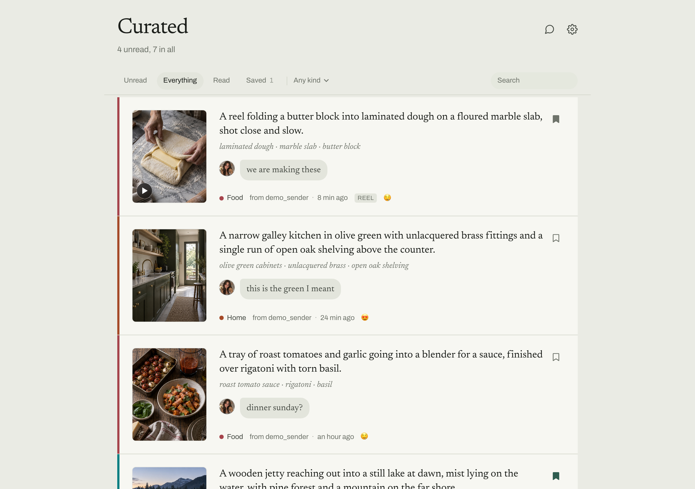
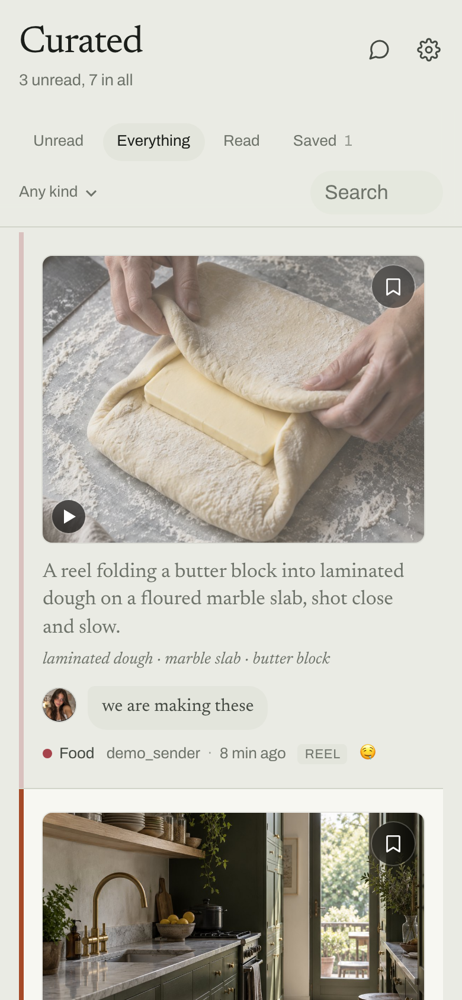
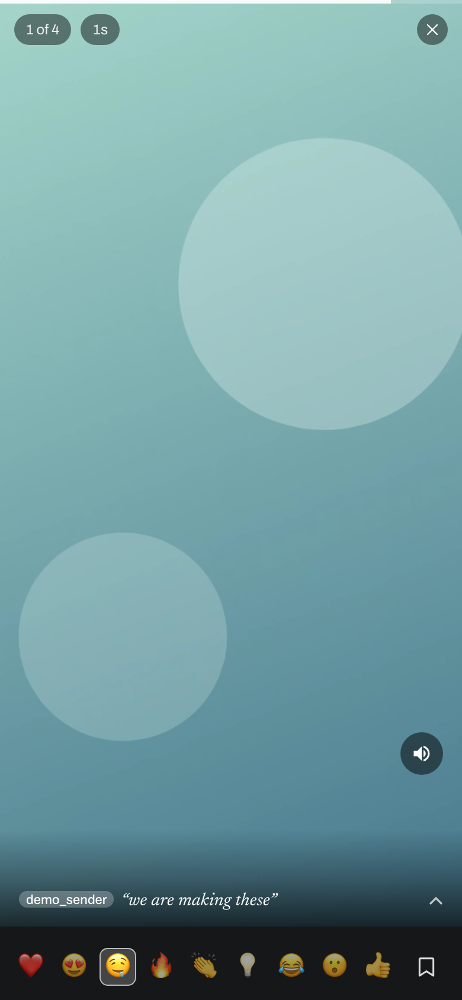
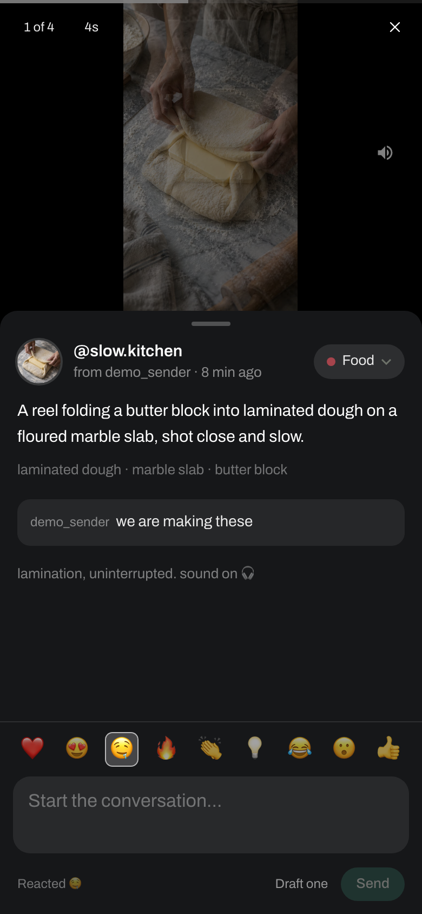

# Curated

**Everything the people you love send you on Instagram, in one place you can
actually get through.**

Your partner sends reels. Your friends send recipes, flats, jokes, things you
said you would look at. It piles up in a DM list you have to fight your way
back into every time, inside an app built to send you somewhere else. Curated
is that pile on its own, with nothing else in it.

## What it looks like

The pile, newest first, with a colour down the left edge per category. Reading a
post recedes it without moving it, so the list empties from the top rather than
reshuffling under you.



On a phone it is the same list, and a post opens full screen with the reactions
under your thumb. The card carries what the model made of it: a description, the
concrete things it names, and whatever the sender typed alongside the share.

<p align="center">
  
  
  
</p>

A reel plays full screen, in the app, with the reactions along the bottom and
the sender's message over the foot of it. A swipe up is the next thing they
sent rather than whatever Instagram would rather show you.

Every post, sender and message above is invented, and the photographs are
generated. Screenshots of the real thing would be someone's private messages
and a wall of other people's pictures.

## What it does

**1. Your pile, not a feed.** Every post and reel anyone has sent you, newest
first, unread on top. Swipe up and you get the next thing *they* sent, not
whatever the algorithm would rather you watched. Nothing else is in here: no
explore, no suggestions, no drift.

**2. React and reply without losing your place.** The reactions sit under your
thumb while the reel is still playing, and what you pick goes back into the
real thread, so they know it landed. No backing out to the message, pressing
it, choosing, and then hunting for where you were.

**3. Every post read and sorted for you.** Claude looks at the picture and the
caption and writes a line saying what it actually is, files it under a
category, and names the things in it. A hundred anonymous thumbnails become a
list you can scan in a few seconds — and search.

**4. Save the ones worth coming back to.** The recipe you meant to cook, the
paint colour, the place. Kept in one list instead of scrolled past and lost.

**5. The conversation, live.** Reply to any post straight into the thread it
came from. There is a chat view too, which reads the thread the moment it
stirs, so a real back-and-forth works without opening Instagram at all.

Read and unread are the spine of the whole thing, so the pile empties instead
of growing.

## Why it exists

Someone you love lives on Instagram. You would rather not.

That is the whole problem. Staying means the feed, the suggestions, the pull —
an app built so that going in for one reel costs you twenty minutes. Leaving
means losing the things they send you and the small conversation that goes with
them, which was never the part you wanted to be rid of.

This takes the second without the first. What arrives here is exactly what one
person chose to send you, in the order they sent it, and nothing else. No
algorithm, no explore, no drift. You can react, reply, and now hold a proper
conversation, without opening Instagram at all.

The thing that started it was narrower. A backlog of shared reels is close to
unusable inside Instagram itself:

- **A swipe up goes to the algorithm.** Opening a shared reel works fine;
  leaving it is the problem. Swipe up and Instagram answers with its own
  recommendations rather than the next thing they sent, so every post means
  backing out to the thread and finding your place again.
- **Reacting means going back as well** — return to the message, press it,
  choose. For every single one.
- **Nothing tracks what you have already seen.** A hundred shares in, there is
  no way to tell which ones you have watched, so the backlog only grows.

Here the pile is the interface. A swipe moves to the next thing they sent. The
reactions are under your thumb while you are watching. Read and unread are the
spine of the whole thing, so the pile empties instead of accumulating.

## What happens to a post

1. Signs in to Instagram with a real browser and keeps the session on disk.
2. Reads your DMs and pulls out every post and reel shared with you.
3. Copies each thumbnail locally, because Instagram's image URLs expire.
4. Sends each post to Claude, which looks at the picture and the caption and
   writes a short description, a category, the concrete things it names, and the
   emoji it deserves.
5. Reacts to the message in the thread with that emoji.

## How it works, and why

**Reading DMs.** Instagram's Graph API cannot do this — DM access requires a
business account wired to a Facebook page, and the messaging endpoints do not
return what you need even then. So the app drives Chromium, signs in, and calls
the same JSON endpoints instagram.com itself calls. That is far steadier than
scraping the DM page, which changes constantly.

Shared posts arrive in several message shapes that Instagram keeps renaming —
`media_share`, `clip`, `story_share`, and lately the `xma_*` forms. Rather than
matching on `item_type`, each message is searched for anything carrying a post
shortcode or an instagram.com link. Bare links get their thumbnail and caption
from the post page's Open Graph tags.

**Describing posts.** Each post goes to Claude through the
[Claude Agent SDK](https://code.claude.com/docs/en/agent-sdk), which drives the
Claude Code installed on the machine — so it uses your existing Claude
credentials and needs no API key. The agent gets one tool, `Read`, pointed at
the downloaded thumbnail. Most reels say nothing useful in the caption, and the
picture is the only real signal.

**Reacting.** Instagram's web client does not react over REST; the
`direct_v2/.../react` style endpoints all 404. It sends a Relay mutation,
`IGDirectReactionSendMutation`, and the identifiers are not the ones the DM API
hands back: the message is addressed by its `mid.$...` message id rather than
`item_id`, and the thread by its `thread_v2_id` rather than `thread_id`. Both
were read out of Instagram's own JavaScript bundle. If reactions start failing
with a GraphQL error rather than a network one, the persisted-query id in
`src/lib/instagram/react.ts` is the first thing to re-check.

**Where the traffic comes from.** This matters more than anything else here.
Instagram treats datacenter addresses as suspect: from a cloud VM the login
endpoint returns 429 while the home page loads fine, and a session cookie minted
in your browser at home but used from a server is a mismatch it weighs against
you. Running the browser through a proxy at home fixes both. Without one, expect
rate limits and, eventually, a locked account.

## Requirements

Whichever way you run it:

- A **Claude credential** for the analysis agent. The SDK resolves it the way
  the CLI does - `CLAUDE_CODE_OAUTH_TOKEN` from the environment, an
  `ANTHROPIC_API_KEY`, or a login at `~/.claude/.credentials.json`. Both
  deployed paths use the first: a long-lived token from `claude setup-token`,
  read from a file the Mac keeps at `~/.curated/claude-token` and passed to the
  container through `.env`. An interactive login is fine for `npm run dev`, but
  on macOS it lives in the keychain, which a launchd job cannot read and a
  rebooted machine cannot reach at all until someone signs in at the console.
- A **residential connection**, or the proxy setting pointed at one. Instagram
  treats datacentre addresses as suspect, for the reasons above.

Running natively also wants **Node 22** - not whatever is current, because
`better-sqlite3` has no prebuilt binary for Node 26 and will not compile against
its headers, which leaves the app unable to open its own database - and Chromium
for Playwright. The container brings both with it.

## Installing

Two paths. The Mac one is how this actually runs. Docker is for trying it on
Linux, and is the rollback; nothing routine uses it.

### On a Mac

```bash
npm ci
npx playwright install chromium
npm run dev            # http://localhost:3000
```

That is enough to look at it. To have it keep running, `deploy/mac/` holds the
login agent and `deploy/mac/README.md` is the procedure:

```bash
launchctl bootstrap gui/$(id -u) ~/Library/LaunchAgents/com.curated.plist
launchctl bootout    gui/$(id -u)/com.curated.app        # to stop it
```

### With Docker

```bash
cp .env.example .env              # then put a token in it, see below
docker compose up -d --build      # http://127.0.0.1:3010
docker compose logs -f
```

The image is Playwright's own, so Node and Chromium arrive with it and the Node
22 rule does not apply. Settings come from `.env`, which Compose reads by
itself:

| Variable | Default | What it is |
| --- | --- | --- |
| `CLAUDE_CODE_OAUTH_TOKEN` | none | the analysis agent's credentials |
| `CURATED_DATA` | `./data` | database, media, session, logs |
| `INSTA_PORT` | `3010` | published on loopback only, never on `0.0.0.0` |
| `TZ` | `America/New_York` | the report buckets send times in local time |
| `ANALYSIS_CONCURRENCY` | `3` | posts described at once, one agent each |

**The token is the whole credential story here**, the same long-lived token from
`claude setup-token` that the Mac keeps at `~/.curated/claude-token`. If you
have that file already, reuse it rather than minting a second:

```bash
CLAUDE_CODE_OAUTH_TOKEN=$(cat ~/.curated/claude-token) docker compose up -d
```

The container used to bind-mount `~/.claude` instead. That only worked when the
host uid happened to be 1001, since the credentials file inside is mode 600, and
it handed the container every other credential and project record in that
directory to read one token. A token in the environment does neither.
`ANTHROPIC_API_KEY` also works and is billed per request rather than to a plan.

`docker-compose.dev.yml` is the same image with the source bind-mounted and
`next dev`, on port 3011.

Neither CuratedBar nor Tunnelbar belongs to this path. The first is a macOS menu
bar app; the second is how the Mac runs its connector. Expose the container
however that host already exposes things: a reverse proxy in front of
`127.0.0.1:3010`, or a Cloudflare tunnel pointed at it.

### How it actually runs

On a Mac mini at home. Three pieces, and only the first of them is Curated:

| Piece | What it is |
| --- | --- |
| The app | a login agent, `com.curated.app`. `deploy/mac/` holds it, and `deploy/mac/README.md` is the procedure |
| [CuratedBar](menubar/) | a small menu bar app, in this repo, showing whether the server is up, when it last synced, and whether anyone can reach it |
| The tunnel | not Curated's to run any more. [Tunnelbar](https://github.com/marcusadolfsson/tunnelbar) starts the connector and keeps it up |

The tunnel used to be a second login agent here, `com.curated.tunnel`. It is
gone: one app that understands connectors beats a plist per project, and
Tunnelbar restarts a connector that dies rather than leaving `KeepAlive` to
restart it blind.

It used to run as a container on a cloud VM, reaching Instagram through an HTTP
proxy on the NAS so that the traffic left from a residential address rather than
a datacentre one. Running it at home makes the proxy redundant rather than
replacing it: the address Instagram sees is the same one it always saw, with one
fewer thing in the path to be down at three in the morning. It is also a better
disguise, because the browser is now a genuine macOS Chromium whose user agent
and client hints agree with the machine underneath, rather than a Linux build
claiming to be Windows.

A **login agent, not a daemon**, deliberately: it has to run inside the
logged-in session, because it drives a real browser and because the analysis
agent borrows the account's own Claude credentials. A daemon has neither.

On the Mac, one secret sits outside the repo at mode 600, so it is never
committed and can be rotated on its own:

```
~/.curated/claude-token    the analysis agent's OAuth token
```

`~/.curated/tunnel-token` is still on disk and nothing here reads it. The
connector's credentials went with the connector, to Tunnelbar.

## Setting it up

**Sign in.** Setup page, paste a session cookie: sign in at instagram.com in
your own browser, copy the `sessionid` cookie, paste it in. That is the only
way, on purpose. The password login was removed - Instagram throttles
`/accounts/login/` by IP, and every scraper posts the same plaintext
`#PWD_INSTAGRAM_BROWSER:0:` shape at it, which the real page stopped doing years
ago.

**Choose the conversations.** *Refresh conversations* reads your inbox and lists
who you talk to without importing anything. Tick the ones to follow. With
nothing ticked, every conversation is read — which is how you find the one worth
watching, but not what you want long-term.

## Settings

| Setting | What it does |
| --- | --- |
| Model | Which Claude model describes posts. Sonnet by default; Haiku is cheaper, Opus more careful. |
| How hard it thinks | Effort level for the description. |
| Extra instructions | Appended to the prompt, so you can steer it without editing code. |
| Conversations per check | How many inbox threads a sync looks at. |
| History for a new conversation | How far back to read a conversation the first time. After that a sync reads back to wherever the last one finished. |
| Describe new posts as they arrive | Turn off to import first and describe selectively. |
| React automatically | Off by default. Reacts once a post has been described. |
| Newest posts eligible | How far back reactions may reach. See below. |
| Seconds between reactions | Spacing. Ten is gentle; a burst is not. |
| Proxy | Where Instagram traffic leaves from. Empty now that it runs at home. |

## Safety rails

**The reaction window.** Instagram's DM API does not report existing reactions —
the thread payload carries no reaction data at all, so the app cannot tell which
messages you already reacted to by hand. The window is what keeps it off the old
ones: only the newest N unreacted posts are ever touched. If a post in that
window already carries your reaction, the app's would replace it, since
Instagram allows one reaction per person per message.

**The circuit breaker.** A 429 from Instagram stops the automation for six hours
and says so in the feed, with a button to resume. The response to Instagram
objecting is to stop until a person looks at it, not to retry. `/api/pause` also
stops it by hand for a day.

**Session checks are cached** for five minutes. Every page load asking whether
the session is still valid is two authenticated requests, and a session does not
change minute to minute.

## Scheduling

Mostly there is no schedule. The app keeps a tab open on the DM inbox and
listens to the realtime sockets the page itself opens; when one stirs it waits a
minute or five, the way a person does, and then reads. The tab is open from
seven to eleven and closed overnight.

A sync reads back to wherever the last one finished, however long ago that was.
That is what makes an outage recoverable: a machine that slept for three days
catches up on three days rather than on a fixed number of messages, which used
to leave a hole nothing ever returned to.

## When something is wrong

Start with the menu bar icon: monochrome means healthy, and the panel says what
is wrong when it is not. The same answer without a screen:

```bash
~/Applications/CuratedBar.app/Contents/MacOS/CuratedBar --report
```

Then, for detail:

```bash
tail -f ~/insta/data/curated.log            # the app
curl -s localhost:3000/api/session          # signed in?
curl -s localhost:3000/api/watch            # is it listening, and on how many sockets
curl -s -X POST localhost:3000/api/session/egress   # the address Instagram sees
launchctl print gui/$(id -u)/com.curated.app | head -20
```

The connector's log is Tunnelbar's now, under
`~/Library/Application Support/Tunnelbar/logs/`. `data/tunnel.log` stops at the
moment the old login agent was retired and is kept only as history.

Read the session answer literally. **Signed out** means Instagram sent the tab
to a login page or a challenge, and nothing retries until a cookie is pasted.
Anything else that fails is a fault: it backs off, doubling up to half an hour,
and recovers on its own. Those two used to be one test - "the tab is not on
/direct/" - and an aborted navigation leaving the tab on `about:blank` read as
being thrown out, condemning a session whose cookie was perfectly good.

**A 429 stops everything for six hours** rather than being retried, and says so
in the feed with a button to resume.

## How it is reached

Your own hostname is a Cloudflare tunnel to `localhost:3000` on the Mac, with a
Cloudflare Access policy in front. Nothing is exposed to the LAN and no port is
forwarded; the connector dials out.

The connector is started and supervised by
[Tunnelbar](https://github.com/marcusadolfsson/tunnelbar), which owns it and
restarts it if it dies. Nothing in this repo starts, stops or configures it, and
`deploy/mac/` no longer ships a plist for it.

The Access policy is attached to the **hostname**, not to the origin, so it
survives the origin moving. Migrating from the cloud box was a matter of
standing up a second tunnel and repointing one CNAME - the login page never
changed.

The container is still buildable, and `docker-compose.yml` says so at the top:
Linux is a testing target and the rollback, not how this is deployed.

It is a **separate tunnel** rather than a second connector on the existing one,
because two connectors on one tunnel are a load-balanced pair: Cloudflare would
send requests to whichever, and half of them would land on a machine with a
different database. The old tunnel's ingress rule for this hostname was left in
place deliberately - it is the rollback. Point the CNAME back and start the
container.

## What lives where

Everything the app writes is under `DATA_DIR` (`./data` by default):

```
data/insta.db                 posts, threads, settings, sync history
data/media/                   thumbnails, cached reels and gallery photos
data/session/instagram.json   the Instagram session (mode 600)
data/curated.log              the app
data/tunnel.log               the connector, up to the day it moved to Tunnelbar
```

Outside the repo, and deliberately so:

```
~/.curated/claude-token                            the analysis agent's OAuth token (mode 600)
~/Library/LaunchAgents/com.curated.plist           the app at login
~/Library/LaunchAgents/com.curated.menubar.plist   CuratedBar at login
```

The connector's state belongs to Tunnelbar and lives under
`~/Library/Application Support/Tunnelbar/`.

Treat `data/session` as a password: anyone holding it is signed in as you. The
media is worth keeping too - those CDN links expired hours after they were
fetched, so the only other way to get a thousand thumbnails back is a thousand
requests to Instagram.

## Known limits

- A reel is judged from its cover frame and caption, not the video, so a reel
  whose point only appears mid-video gets a thin description.
- Only posts a sync has actually read carry the message id reactions need.
  Older posts can be described but not reacted to.
- The DM endpoints and the reaction mutation are the website's own, not a
  documented API. They change. Extraction is written defensively, but a sync
  that suddenly finds nothing usually means a message shape changed.
- A session cookie is the only way in. Instagram challenges automated logins
  from a new device or location, and the login endpoint is throttled by IP.
- **The chat view opens one conversation, and there is no way to switch.** The
  feed handles as many people as you follow, and replying to a post always goes
  back to the thread that post came from. The standalone chat is the exception:
  it takes whichever followed conversation the database returns first. The
  endpoint behind it already accepts a thread, so what is missing is the picker
  in front of it.

## Licence

MIT. See [LICENSE](LICENSE).

It drives Instagram with a real browser and a real session, which is yours to
account for: automation is against their terms, and an account driven hard
enough gets locked. The pacing here is deliberately slow for that reason. Run
it on your own account, and read the safety rails above before changing any of
the waits.
