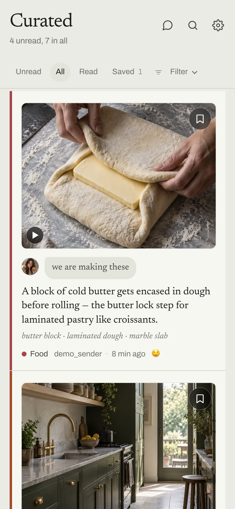
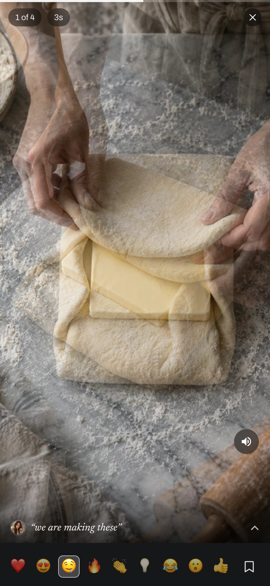
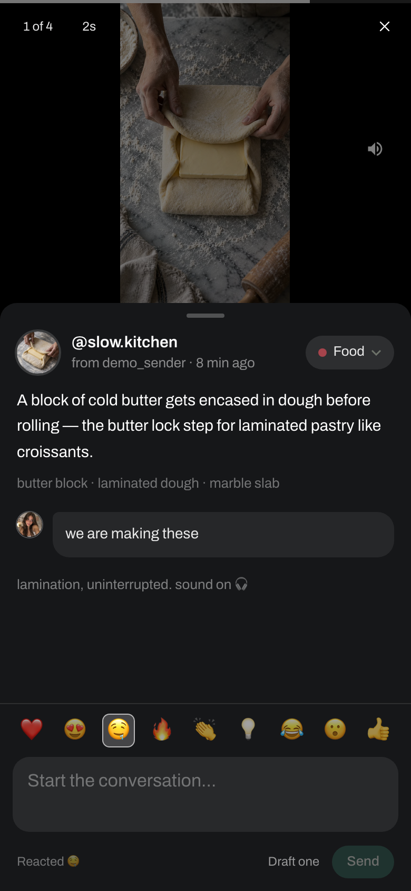
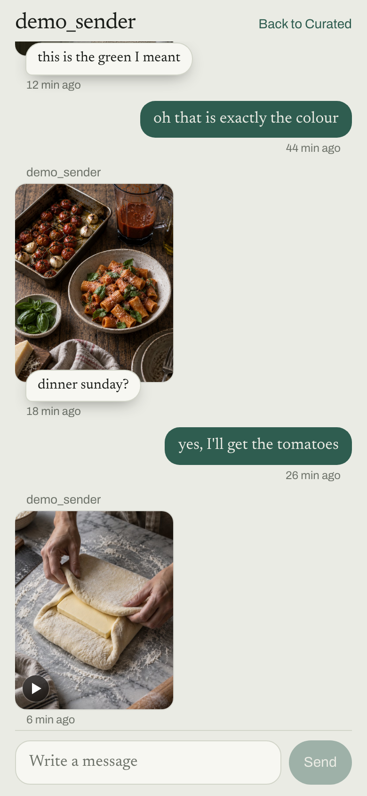
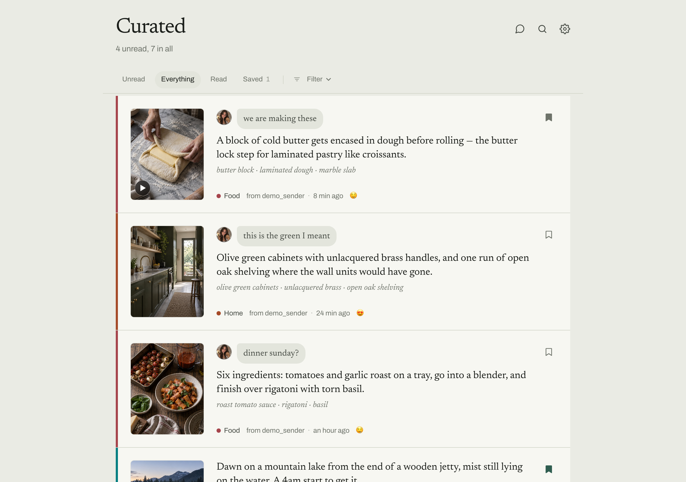

# Curated

**Everything the people you love send you on Instagram, in one place you can
actually get through.**

Your partner sends reels. Your friends send recipes, flats, jokes, things you
said you would look at. It piles up in a DM list you have to fight your way
back into every time, inside an app built to send you somewhere else. Curated
is that pile on its own, with nothing else in it.

## What it looks like

It is built for a phone, because that is where the things people send you
arrive. The pile, a post full screen, its card pulled up, and the conversation:

<p align="center">
  
  
  
  
</p>

A swipe up is the next thing they sent. The reactions are under your thumb
while it plays. Pull the card up for what the model made of it, and reply
without leaving. In the conversation a share is the picture itself, and it
opens here rather than in Instagram.

The same list on a desktop, with a colour down the left edge per category:



Every post, sender and message above is invented and the photographs are
generated, but the descriptions are not: they are what the app itself wrote
about these pictures. Screenshots of the real thing would be someone's private
messages.

## What it does

**1. Your pile, not a feed.** Every post and reel anyone has sent you, newest
first, unread on top. Swipe up and you get the next thing *they* sent, not
whatever the algorithm would rather you watched. Nothing else is in here: no
explore, no suggestions, no drift.

**2. React and reply without losing your place.** The reactions sit under your
thumb while the reel is still playing, and what you pick goes back into the
real thread, so they know it landed. No backing out to the message, pressing
it, choosing, and then hunting for where you were.

**3. Every post read and sorted for you.** Claude looks at the picture and the
caption and writes a line saying what it actually is, files it under a
category, and names the things in it. A hundred anonymous thumbnails become a
list you can scan in a few seconds — and search.

This part is optional. Run it without a Claude credential and nothing is
described or categorised: the post's own caption stands in, the category rail
and filter are simply not there, and everything else — unread, saving,
reactions, replies, the chat — works exactly the same.

**4. Save the ones worth coming back to.** The recipe you meant to cook, the
paint colour, the place. Kept in one list instead of scrolled past and lost.

**5. The conversation, live.** Reply to any post straight into the thread it
came from. There is a chat view too, which reads the thread the moment it
stirs, so a real back-and-forth works without opening Instagram at all.

Read and unread are the spine of the whole thing, so the pile empties instead
of growing.

## Why it exists

Someone you love lives on Instagram. You would rather not.

That is the whole problem. Staying means the feed, the suggestions, the pull —
an app built so that going in for one reel costs you twenty minutes. Leaving
means losing the things they send you and the small conversation that goes with
them, which was never the part you wanted to be rid of.

This takes the second without the first. What arrives here is exactly what one
person chose to send you, in the order they sent it, and nothing else. No
algorithm, no explore, no drift. You can react, reply, and now hold a proper
conversation, without opening Instagram at all.

The thing that started it was narrower. A backlog of shared reels is close to
unusable inside Instagram itself:

- **A swipe up goes to the algorithm.** Opening a shared reel works fine;
  leaving it is the problem. Swipe up and Instagram answers with its own
  recommendations rather than the next thing they sent, so every post means
  backing out to the thread and finding your place again.
- **Reacting means going back as well** — return to the message, press it,
  choose. For every single one.
- **Nothing tracks what you have already seen.** A hundred shares in, there is
  no way to tell which ones you have watched, so the backlog only grows.

Here the pile is the interface. A swipe moves to the next thing they sent. The
reactions are under your thumb while you are watching. Read and unread are the
spine of the whole thing, so the pile empties instead of accumulating.

## What happens to a post

1. Notices a new message: the Instagram API keeps a feed of what arrived, and
   Curated waits on it.
2. Reads the conversation and pulls out every post and reel shared in it.
3. Looks each one up by its link for the cover and caption, and copies the
   cover locally, because Instagram's image URLs expire.
4. Sends each post to Claude, which looks at the picture and the caption and
   writes a short description, a category, the concrete things it names, and the
   emoji it deserves.
5. Reacts to the message in the thread with that emoji, when you ask it to.

## How it works, and why

**Reading DMs.** Through an Instagram API service that wraps an authorised Meta
product and holds the account's session. Curated never signs in to Instagram
itself and runs no browser. The service runs on another machine, which accepts
no inbound connections, so it keeps a reverse SSH tunnel open to the Mac and
answers there as `http://127.0.0.1:8000`, with an `X-API-Key` that Curated
reads from `~/.curated/instagram-api-key`. Its code is in
[`instagram-api/`](instagram-api/), and
[`docs/instagram-api.md`](docs/instagram-api.md) describes how to stand it up.

It polls the inbox itself, every five minutes, and keeps what it saw as
`/dms/updates`. Curated long-polls that feed - a request that goes to the API
and no further - so a sync runs only when somebody actually sent something,
and nothing on the Mac ever asks Instagram "anything new?". When it does sync,
it reads each followed conversation back to wherever the last sync finished.

Shared posts arrive as links. Each message is searched for anything carrying a
post shortcode or an instagram.com link, rather than matched on a message type
that Instagram keeps renaming. The link is looked up through the API's
`/posts/by-url` for the caption, author and cover, which it resolves with
Instagram's public oEmbed lookup, without the account. A reel's video comes
from `/posts/video` and every photo of a carousel from `/posts/images`, both
found logged-out and handed back as signed CDN links that Curated downloads at
once.

**Describing posts.** Each post goes to Claude through the
[Claude Agent SDK](https://code.claude.com/docs/en/agent-sdk), which drives the
Claude Code installed on the machine - so it uses your existing Claude
credentials and needs no API key. The agent gets one tool, `Read`, pointed at
the downloaded cover. The caption is where most of the facts live; the picture
fills the gaps, and carries the posts whose caption says nothing.

**Listening to reels.** A reel's video is downloaded anyway, so what is said
in it is transcribed on the Mac - [whisper.cpp](https://github.com/ggml-org/whisper.cpp)
on the GPU, with the large-v3-turbo model and Silero voice detection in front
of it, after `afconvert` (part of macOS) pulls the audio out. The description,
the Travel places and the Upcoming dates all read the transcript beside the
caption. Voice detection is not optional in practice: on a reel that is all
music, Whisper alone writes a confident sentence nobody said. Nothing leaves
the machine. Without whisper.cpp and its models this switches itself off.

**Upcoming.** A text pass over each described post - the description, the
caption and the transcript - pulls out the dates worth acting on: tickets going
on sale, the nights of an event, the last day to book, an opening. The Upcoming
page lists the ones still ahead by month, each with an *Add to calendar* link
that serves an `.ics` file.

**Reacting and replying.** Sending through the API asks for approval on its
side, one action at a time, so Curated puts reactions and replies in the API's
outbound queue instead (`/dms/react/queue`, `/dms/send/queue`). A scheduled
task there with one standing approval sends them within about half a minute,
and only marks one sent when Instagram's own tool says it was created. Curated
checks `/dms/queue` afterwards and takes a reaction back off the post if it
failed. A message is addressed by its `mid.$...` id. Instagram toggles a
reaction sent twice, so Curated never sends one a post already carries.

## Requirements

- **The Instagram API, and its tunnel to this Mac.** See
  [`docs/instagram-api.md`](docs/instagram-api.md). Remote Login on, and the Mac
  kept awake - the tunnel dies with sleep.
- **An Instagram account you are willing to automate.** Even through an
  authorised product, an account driven too hard gets locked. The pacing, the
  six-hour stop and the refusal to retry exist because of that rather than
  because of taste.

**Transcription** is optional too: `brew install whisper-cpp`, then the two
models into `models/` under the data directory -
[`ggml-large-v3-turbo-q5_0.bin`](https://huggingface.co/ggerganov/whisper.cpp)
(574 MB) and
[`ggml-silero-v5.1.2.bin`](https://huggingface.co/ggml-org/whisper-vad) (885 KB).
An M1 transcribes a minute of speech in about ten seconds.

A **Claude credential** is optional. Without one the app is still a reader - it
collects, files, saves, reacts and replies; what stops is describing and
categorising, and the interface removes those rather than showing empty ones.
The SDK resolves it the way the CLI does: `CLAUDE_CODE_OAUTH_TOKEN`, an
`ANTHROPIC_API_KEY`, or a login at `~/.claude/.credentials.json`. *Sign in with
Claude* in the menu bar runs `claude setup-token` and keeps what it returns in
`~/.curated/claude-token`. Not the keychain: a launchd job cannot read it
reliably, and a rebooted machine cannot reach it at all until somebody signs in
at the console.

**Node 22** matters only if you are running from a checkout - `better-sqlite3`
has no prebuilt binary for Node 26 and will not compile against its headers, so
a newer runtime leaves the app unable to open its own database. The app bundle
carries its own, from nodejs.org rather than Homebrew, whose `node` is a 67 KB
shim against seventeen of its own dylibs and cannot be copied anywhere.

## Installing

It is one app. Releases are notarized DMGs; to build it yourself:

```bash
cd menubar && make install-standalone
```

That builds **Curated.app** and puts it in `/Applications`. Open it once and it
offers to start at login. It carries its own Node and its own built server and
runs them as a child process, so there is no Homebrew, no checkout to keep, no
plist to edit and no `sudo`. Everything after that is in the menu bar: sign in
with Claude, start at login, keep the Mac awake.

There was a container and a set of systemd units for the Linux box this used to
live on, and a signed-in Chromium for reading Instagram before the API; all of
it is gone. Git history has them.

### Working on it

The app bundle is for running it, not for changing it. For that:

```bash
npm ci
npm run dev            # http://localhost:3000
```

`deploy/mac/` still holds a login agent that runs the server straight from a
checkout, which is the way to have a working copy running all day. The two are
mutually exclusive on purpose - the app refuses to start a second server while
anything answers on the port.

`menubar/` builds without the server too (`make install`), which is the fast
loop when the menu bar app itself is what you are changing.

### How it actually runs

On a Mac mini at home. Three pieces, and only the first is Curated:

| Piece | What it is |
| --- | --- |
| **Curated.app** | the menu bar app and the server it supervises, `com.curated.app` at login |
| The Instagram API | on another machine, reached through the tunnel it holds to this Mac |
| The Cloudflare tunnel | not Curated's to run. [Tunnelbar](https://github.com/marcusadolfsson/tunnelbar) starts the connector and keeps it up |

It runs in the **logged-in session, not as a daemon**, deliberately: the
analysis agent borrows the account's own Claude credentials. A daemon has none.

The supervisor waits thirty seconds before a restart, so a server failing at
boot does not loop, and will not start while anything already answers on the
port - with one exception it can prove, its own orphan, identified by a pid
file, because killing the app does not kill the process it started.

Two secrets sit outside the repo at mode 600, so they are never committed and
can be rotated on their own:

```
~/.curated/claude-token          the analysis agent's OAuth token
~/.curated/instagram-api-key     the Instagram API's key
```

## Setting it up

**Choose the conversations.** *Refresh conversations* on the Setup page reads
your inbox and lists who you talk to without importing anything. Tick the ones
to follow. With nothing ticked, every conversation is read - which is how you
find the one worth watching, but not what you want long-term.

## Settings

| Setting | What it does |
| --- | --- |
| Model | Which Claude model describes posts. Sonnet by default; Haiku is cheaper, Opus more careful. |
| How hard it thinks | Effort level for the description. |
| Extra instructions | Appended to the prompt, so you can steer it without editing code. |
| Conversations per check | How many inbox threads a sync looks at. |
| History for a new conversation | How far back to read a conversation the first time. After that a sync reads back to wherever the last one finished. |
| Listen for new messages | Waits on the API's update feed and syncs when something arrives. Off, posts arrive when you check by hand. |
| Describe new posts as they arrive | Turn off to import first and describe selectively. |
| Transcribe reels | `transcribeReels`: on by default, and does nothing without whisper.cpp. |
| React automatically | Off by default. Reacts once a post has been described. |

## Safety rails

**The circuit breaker.** A 429 from Instagram, or from the API in front of it,
stops the automation for six hours and says so in the feed, with a button to
resume. The response to Instagram objecting is to stop until a person looks at
it, not to retry. `/api/pause` also stops it by hand for a day.

**A daily ceiling.** Syncs follow real messages, so this is never reached by
somebody sharing reels; reaching it means something is looping. It is counted
from the sync history, so a restart cannot reset it.

**One client.** Nothing on the Mac signs in to Instagram. The account has one
session, on the API's side.

## When something is wrong

Start with the menu bar icon: monochrome means healthy, and the panel says what
is wrong when it is not. The same answer without a screen:

```bash
/Applications/Curated.app/Contents/MacOS/Curated --report
```

Then, for detail:

```bash
tail -f ~/Library/Application\ Support/Curated/curated.log   # the app, and the server it runs
curl -s localhost:3000/api/session                  # does the Instagram API answer?
curl -s localhost:3000/api/watch                    # is it listening, and when did the API last check
curl -s localhost:8000/health                       # the API itself, through the tunnel
```

**The Instagram API is not answering** means the API or its tunnel is down.
Both are restarted on the API's side within minutes, and the watcher picks up
where it left off: it asks for everything since the last message it saw.

To restart the app, quit it and open it again - the server is its child and
stops with it. `launchctl kickstart` will not do it: the login agent runs
`open -a`, which activates an app that is already running rather than starting
the new one.

## How it is reached

Your own hostname is a Cloudflare tunnel to `localhost:3000` on the Mac, with a
Cloudflare Access policy in front. Nothing is exposed to the LAN and no port is
forwarded; the connector dials out.

The connector is started and supervised by
[Tunnelbar](https://github.com/marcusadolfsson/tunnelbar), which owns it and
restarts it if it dies. Nothing in this repo starts, stops or configures it.

The Access policy is attached to the **hostname**, not to the origin, so it
survives the origin moving - and it is the only thing between the internet and
the app, which has no login of its own. After any hostname change, check that
an unauthenticated request gets a 302 to the Access login.

## What lives where

Everything the app writes is under `DATA_DIR`, which is
`~/Library/Application Support/Curated` unless something says otherwise:

```
insta.db                 posts, threads, settings, sync history
media/                   covers, cached reels and gallery photos
models/                  Whisper and the voice-detection model, for transcribing reels
curated.log              the app, and anything it starts
server.pid               which server this app started, so an orphan can be told apart
```

Outside it, deliberately:

```
~/.curated/claude-token                        the analysis agent's OAuth token (mode 600)
~/.curated/instagram-api-key                   the Instagram API's key (mode 600)
~/Library/LaunchAgents/com.curated.app.plist   Curated at login
```

The media is worth keeping: those CDN links expired hours after they were
fetched, so the only other way to get a thousand covers back is a thousand
lookups.

## Known limits

- A reel is read from its cover, its caption and what is said in it - not
  from what it shows after the first frame. A reel whose point is visual and
  silent still gets a thin description.
- Reactions cannot be taken back through the API.
- The API's conversation view carries no reactions, so Curated cannot see a
  reaction made in Instagram itself.
- **The chat view opens one conversation, and there is no way to switch.** The
  feed handles as many people as you follow, and replying to a post always goes
  back to the thread that post came from. The standalone chat is the exception:
  it takes whichever followed conversation spoke most recently.

## Licence

MIT. See [LICENSE](LICENSE).

It reads a real Instagram account, which is yours to account for: an account
driven hard enough gets locked, whatever reads it. The pacing here is deliberately slow for that reason. Run
it on your own account, and read the safety rails above before changing any of
the waits.
